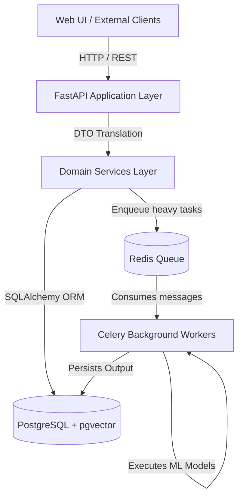
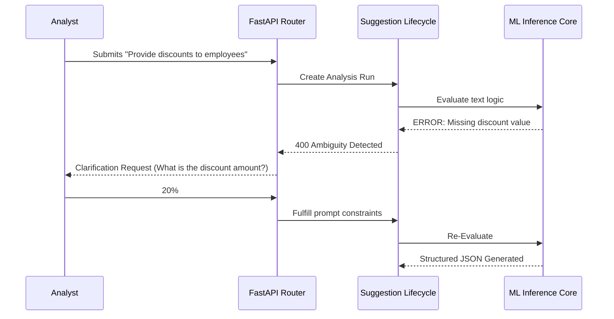

# V4 System Architecture: Rule Intelligence Engine

## 1. Executive Overview
The **Rule Intelligence Engine (V4)** is an enterprise-grade platform designed to automatically ingest unstructured business feedback, map it against a corpus of existing canonical rules, and generate deterministic, machine-readable rule structures natively. 

To ensure AI generations aren’t silently pushed into production, the system relies on a **Modular Monolith** architecture featuring a robust deterministic validation framework and strict manual human-in-the-loop governance.

---

## 2. Technical Stack & Component Topology

The system is structurally organized into horizontally isolated layers that decouple HTTP endpoints from heavy ML workloads.

| Component | Technology | Purpose |
| :--- | :--- | :--- |
| **Routing Layer** | FastAPI (Python 3.12) | Exposes standard OpenAPI REST endpoints for UI and Client interaction. Handles schema enforcement. |
| **Database Engine** | PostgreSQL (`pgvector`) | Strictly tracks all operational metrics, governance logic, and performs native vector semantic searches for conflict detection. |
| **Object Relational Mapper** | SQLAlchemy + Alembic | Enforces database constraints and handles dynamic schema migrations securely. |
| **Asynchronous Broker** | Redis | Message queue supporting the background processing of non-blocking heavy ML loops. |
| **Background Orchestrator**| Celery | Picks up jobs from Redis and runs ML pipelines sequentially independent of web server blocking constraints. |

### High-Level Architecture Diagram

---

## 3. End-to-End Processing Logic

The primary heartbeat of the engine parses plain-text feedback into structured JSON blocks. Here is the operational logic that handles that lifecycle:

### A. The Analysis Phase
When feedback enters the system, the analysis logic immediately executes:
1. **Pre-processing:** The system isolates key entities within the unstructured text.
2. **Algorithmic Extraction:** The engine interfaces with the local ML registry to cast unstructured data into a deterministic `{"operation": X, "value": Y}` map.
3. **Semantic Conflict Check:** The newly extracted rule signature is encoded into a vector and queried against PostgreSQL `pgvector`. 
    - If the Cosine Similarity indicates an exact duplicate, the rule is flagged natively.

### B. The Ambiguity & Clarification Pipeline
If the ML model identifies a subjective or missing constraint in the unstructured text, the engine rejects autonomous creation and triggers a clarification loop.

### C. The Background Evaluation Loop (MLOps)
To deploy new prompts and algorithms safely, Data Scientists can test specific `ModelVersion` objects against pre-labeled `DatasetVersion` targets.

Because testing 10,000 datasets can take hours:
1. The `POST /v1/evaluations` API allocates a UUID and inserts `"status": "pending"` into the database, immediately freeing up the client.
2. A message is mapped to `Redis`.
3. An available `Celery` worker consumes the message, simulates the metrics against the dataset, and populates `EvaluationMetric` tables transparently.

---

## 4. Database Relational Topology

The relational database architecture is strict and utilizes UUIDv4 constraint references to prevent arbitrary orphaned elements.

> [!IMPORTANT]
> The Rule Intelligence engine utilizes dual-tracking logic. `AnalysisRuns` track machine operational states, while `RuleSuggestions` strictly manage human governance workflows.

| Core Model | Description | Relationship Constraints |
| :--- | :--- | :--- |
| `Workspace` | Multi-tenant logical isolation bounds. | Parent to all records (Strict Cascading). |
| `AnalysisRun` | Tracks machine learning executions per feedback. | Belongs to `Workspace` and `Feedback`. |
| `RuleSuggestion` | Draft business rule pending human approval. | Belongs to `AnalysisRun`, 1:1. |
| `SuggestionAudit`| Append-only log for SOC2 non-repudiation. | Inherits all actions enacted upon a `RuleSuggestion`. |
| `BackgroundJob` | Tracks generic Celery executions (Metrics). | Independent operational layer. |

This rigid isolation layer ensures that **no AI interaction is deployed to the canonical database without passing identically through the standard UI approval flows.**
